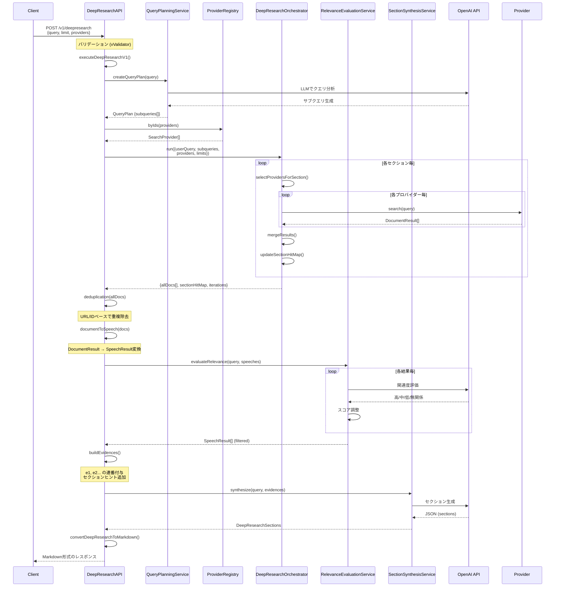

# Deep Research API 詳細実装解析とシーケンス図

## 概要

Deep Research API (`/v1/deepresearch`) は、ユーザーのクエリに対して複数のプロバイダーから情報を収集し、AIによる関連度評価とセクション統合を行い、構造化された回答を生成するエンドポイントです。

## 実装の特徴

### 1. セクション駆動型アーキテクチャ

- **9つの定義済みセクション**: 各セクションが特定の情報ニーズを表現
- **セクション別プロバイダー制御**: 各セクションで利用可能なプロバイダーを個別に制御
- **セクション別ターゲット**: 各セクションに最小必要件数を設定

### 2. セクション単回探索

- **充足度チェック**: セクションごとの取得件数を計測してログ出力
- **単回実行**: すべてのセクションに対して1回の検索ラウンドを実施
- **サブクエリ共有**: 元クエリとプランナーのサブクエリを全セクションで活用

### 3. 重複管理とトラッキング

- **sectionHitMap**: どのドキュメントがどのセクションで使用されたかを追跡
- **URL/IDベース重複除去**: 同一ドキュメントの重複を防止
- **状態管理**: `sectionHitMap` でドキュメントとセクションの関連のみを追跡

## メインフロー



## 主要コンポーネントの役割

### 1. **KokkaiDeepResearchAPI** (メインクラス)

- Honoフレームワークを使用したHTTPサーバー
- リクエストのバリデーション（Valibot使用）
- 処理フローの全体調整
- レスポンスのMarkdown変換

### 2. **QueryPlanningService**

```typescript
createQueryPlan(userQuestion: string): Promise<QueryPlan>
```

- ユーザーのクエリを分析
- 効果的なサブクエリに分解
- OpenAI APIを使用してJSON形式のプラン生成

### 3. **ProviderRegistry**

```typescript
byIds(ids?: string[]): SearchProvider[]
```

- 利用可能なプロバイダーの管理
- KokkaiRagProvider: 国会議事録ベクトル検索
- OpenAIWebProvider: Web検索

### 4. **DeepResearchOrchestrator**

```typescript
run(config): Promise<{allDocs, sectionHitMap, iterations}>
```

- セクション別の検索実行を調整
- `SECTION_ALLOWED_PROVIDERS`に基づくプロバイダー選択
- `SECTION_TARGET_COUNTS`に基づく検索件数制御
- 結果のマージと重複管理

### 5. **RelevanceEvaluationService**

```typescript
evaluateRelevance(query, results): Promise<SpeechResult[]>
```

- 各検索結果の関連度をLLMで評価
- 高/中/低/無関係の判定
- スコア調整と無関係結果の除外

### 6. **SectionSynthesisService**

```typescript
synthesize(query, evidences): Promise<DeepResearchSections>
```

- 収集した証拠から構造化セクションを生成
- OpenAI APIを使用してJSON生成
- 固定スキーマに従ったセクション構成

## データフロー

### 入力データ構造

```typescript
interface DeepResearchRequest {
  query: string; // ユーザークエリ
  limit?: number; // 結果件数上限 (1-100)
  providers?: string[]; // 使用プロバイダーID
  asOfDate?: string; // 基準日
}
```

### 中間データ構造

#### DocumentResult (プロバイダーからの結果)

```typescript
interface DocumentResult {
  id: string;
  title?: string;
  content?: string;
  url?: string;
  date?: string;
  author?: string;
  score: number;
  source: { providerId: string; type: string };
  extras?: Record<string, unknown>;
}
```

#### EvidenceRecord (証拠レコード)

```typescript
interface EvidenceRecord {
  id: string; // e1, e2, e3...
  title?: string;
  content: string;
  url?: string;
  date?: string;
  author?: string;
  score: number;
  source: { providerId: string; type: string };
  sectionHints?: string[]; // 使用されたセクション
}
```

### 出力データ構造

```typescript
interface DeepResearchResponse {
  query: string;
  asOfDate?: string;
  sections: DeepResearchSections;
  evidences: EvidenceRecord[];
  metadata: {
    usedProviders: string[];
    iterations: number;
    totalResults: number;
    processingTime: number;
    timestamp: string;
    version: string;
  };
}
```

## セクション定義

以下のセクションが生成されます（`SECTION_ALLOWED_PROVIDERS`で制御）：

- **purpose_overview**: 目的と概要
- **current_status**: 現状分析
- **key_insights**: 主要な洞察
- **evidence_summary**: 証拠要約
- **timeline**: タイムライン
- **stakeholder_positions**: ステークホルダーの立場
- **implications**: 影響と意味
- **recommendations**: 推奨事項
- **metadata**: メタデータ

## エラーハンドリング

1. **バリデーションエラー**: 400 Bad Request
2. **プランニングエラー**: エラーメッセージ付き500
3. **関連度評価エラー**: エラーメッセージ付き500
4. **JSONパースエラー**: 詳細なエラー情報付き500
5. **タイムアウト**: 各プロバイダーで個別設定

## パフォーマンス最適化

- **並列処理**: 複数プロバイダーへの同時検索
- **重複除去**: URL/IDベースの効率的な重複管理
- **スコアリング**: 関連度に基づく動的スコア調整
- **キャッシュ**: プロバイダーレベルでの結果キャッシュ（将来実装予定）
