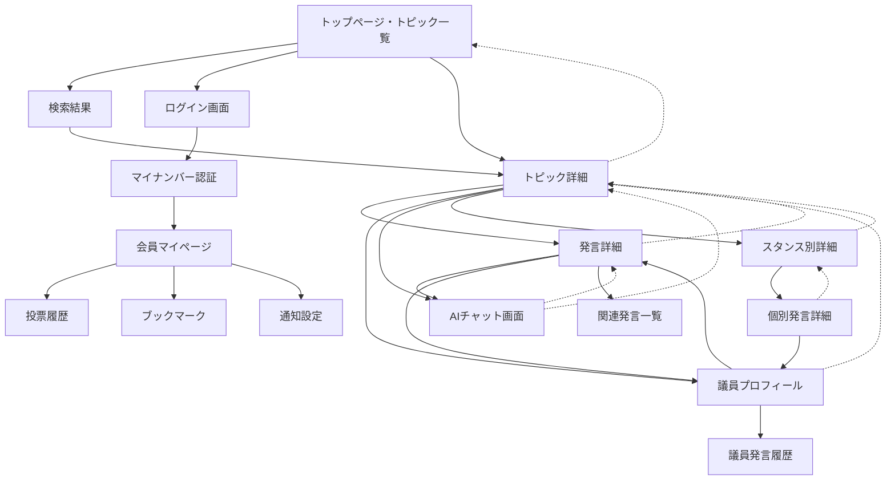

# UI/UX設計仕様

## デザイン原則

### 1. シンプルさ（Simplicity）
- 情報過多を避け、必要な情報を段階的に提示
- 直感的な操作で目的の情報にアクセス可能
- 政治的専門用語を分かりやすく解説

### 2. 透明性（Transparency）
- 情報源の明示
- AI分析結果の根拠表示
- データ収集・利用の透明化

### 3. アクセシビリティ（Accessibility）
- WCAG 2.1 AA準拠
- 多様なデバイス・環境での利用を想定
- 高齢者・障害者にも使いやすい設計

### 4. 政治的中立性（Political Neutrality）
- 特定政党に偏らない色使い・表現
- 客観的事実の提示を重視
- ユーザーの判断を支援する情報提供

## 画面構成

### 1. トップページ（トピック一覧統合）

```
┌─────────────────────────────────────┐
│ [Logo] kokkai-join     [🔍] [ログイン] │
├─────────────────────────────────────┤
│ 🔥 話題のトピック                    │
│                                     │
│ [最新] [人気] [議論中] [解決済み]      │
│ [憲法] [経済] [社会保障] [環境] ...    │
│                                     │
│ ┌─ 💰 経済・財政 ─ 2025-08-14 ────┐  │
│ │ 消費税増税についての議論           │ │
│ │ ┌─ 📄 要約 ──────────────────┐ │ │
│ │ │税率10%→15%への引き上げ案。社会保│ │ │
│ │ │障財源vs経済影響が争点。軽減税率拡│ │ │
│ │ │充案で与野党が歩み寄りの動き。  │ │ │
│ │ └───────────────────────────┘ │ │
│ │ 📊 2,345回閲覧 👥 12名発言        │ │
│ │ 💬 89件 📌 156人が関注           │ │
│ │ [賛成 45%] [反対 35%] [未分類 20%] │ │
│ └─────────────────────────────────┘ │
│                                     │
│ ┌─ 🏥 社会保障 ─ 2025-08-13 ─────┐   │
│ │ 年金制度改革の方向性              │ │
│ │ ┌─ 📄 要約 ──────────────────┐ │ │
│ │ │支給開始年齢の段階的引き上げと保険│ │ │
│ │ │料率見直しを検討。持続可能性と世代│ │ │
│ │ │間公平のバランスが課題。      │ │ │
│ │ └───────────────────────────┘ │ │
│ │ 📊 1,876回閲覧 👥 8名発言         │ │
│ │ 💬 67件 📌 203人が関注           │ │
│ │ [賛成 60%] [反対 25%] [未分類 15%] │ │
│ └─────────────────────────────────┘ │
│                                     │
│ [もっと見る]                        │
│                                     │
└─────────────────────────────────────┘
```

#### 主要コンポーネント
- **ヘッダー**: ロゴ、検索、ログイン機能
- **フィルター**: 時系列（最新/人気/議論中/解決済み）とカテゴリー
- **トピックカード**: 要約付きの議論概要
- **エンゲージメント指標**: 閲覧数、発言者数、関心度
- **スタンス分布**: 賛成/反対/未分類の視覚的表示

### 2. トピック詳細画面

```
┌─────────────────────────────────────────────────┐
│ [←] 消費税増税についての議論                      │
├─────────────────────────────────────────────────┤
│ 💰 経済・財政 | 📅 2025-08-14 | 📊 賛成6 反対5 未分類1 │
│                                                 │
│ 🎯 議論の結果・決定事項                         │
│ ┌─────────────────────────────────────────────┐ │
│ │ ✅ 委員会決定 (2025-08-14)                   │ │
│ │   • 税率15%への段階的引き上げ可決 (賛成7反対6) │ │
│ │   • 軽減税率対象の食料品拡大で修正           │ │
│ │                                             │ │
│ │ 📅 今後の予定                               │ │
│ │   • 2025-08-20: 本会議での採決予定           │ │
│ │   • 2025-09-01: 施行準備期間の詳細協議       │ │
│ │                                             │ │
│ │ 📋 関連する検討事項                         │ │
│ │   • インボイス制度の見直し                   │ │
│ │   • 中小企業支援策の拡充                     │ │
│ │                                             │ │
│ │ [💬 この決定についてAIに聞く]                │ │
│ └─────────────────────────────────────────────┘ │
│                                                 │
│ 📋 議論の争点                                   │
│ ┌─────────────────────────────────────────────┐ │
│ │ • 税率を10%→15%に引き上げるべきか ✅決定     │ │
│ │ • 実施時期（段階的 vs 一括）✅段階的で決定   │ │
│ │ • 軽減税率の適用範囲 ✅食料品拡大で決定      │ │
│ │                                             │ │
│ │ [💬 争点の背景をAIに聞く]                    │ │
│ └─────────────────────────────────────────────┘ │
│                                                 │
│ ┌─ 🟢 賛成系 (6名) ────┐ ┌─ 🔴 反対系 (5名) ────┐ │
│ │ 📝 明確な賛成 (4名)  │ │ 📝 明確な反対 (3名)  │ │
│ │ • 田中財務大臣       │ │ • 山田議員           │ │
│ │ • 佐藤議員           │ │ • 高橋議員           │ │
│ │                      │ │                      │ │
│ │ 📝 条件付き賛成(2名) │ │ 📝 懸念表明 (2名)    │ │
│ │ • 西田議員"軽減拡充" │ │ • 松本議員"時期尚早" │ │
│ │ • 鈴木議員"段階実施" │ │ • 井上議員"影響調査" │ │
│ │ [詳細]             │ │ [詳細]             │ │
│ └──────────────────┘ └──────────────────┘ │
│                                                 │
│ ┌─ ⚪ 未分類 (1名) ───────────────────────────┐ │
│ │ • 田村議員"スケジュール確認のみ" (質問のみ)   │ │
│ │ [詳細]                                     │ │
│ └─────────────────────────────────────────────┘ │
│                                                 │
│ ⏰ 時系列表示 [最新順] [発言順] [重要度順]        │ │
│                                                 │
└─────────────────────────────────────────────────┘
```

#### 主要機能

**議論の帰結重視**
- **結果・決定事項**: 委員会決定、修正内容、今後の予定
- **争点の解決状況**: どの論点が決着したかを明示
- **関連検討事項**: 派生的な議論や関連法案

**スタンス分類の改善**  
- **賛成系**: 明確な賛成 + 条件付き賛成
- **反対系**: 明確な反対 + 懸念表明  
- **未分類**: 質問のみ + 態度保留

**情報収集特化機能**
- **AIチャット**: 決定事項・争点・個別発言についてAIに質問可能
- **時系列表示**: 議論の流れを追跡可能
- **詳細アクセス**: 各発言の完全な文脈へのアクセス

### 4. 発言詳細画面

```
┌─────────────────────────────────────┐
│ [←] 田中議員の発言                   │
├─────────────────────────────────────┤
│ 👤 田中太郎 (自由党・東京都1区)       │
│ 💰 消費税増税についての議論 | 🟢賛成   │
│                                     │
│ 📄 発言全文                         │
│ ┌─────────────────────────────────┐ │
│ │ 社会保障制度の持続可能性を考える  │ │
│ │ と、現在の税収では不十分である。  │ │
│ │ 消費税の段階的引き上げにより...   │ │
│ │ (全文表示)                      │ │
│ └─────────────────────────────────┘ │
│                                     │
│ 💬 この発言についてAIに聞く          │
│ [💬 発言の背景・根拠] [💬 反対意見との比較] │
│ [💬 政策の影響分析] [💬 専門家の見解]    │
│                                     │
│ 📊 関連情報                         │
│ [同議員の過去発言] [関連法案] [統計]  │
│                                     │
└─────────────────────────────────────┘
```

### 5. 議員プロフィール画面

```
┌─────────────────────────────────────┐
│ [←] 田中太郎議員                     │
├─────────────────────────────────────┤
│ 👤 田中太郎                         │
│ 自由党 | 東京都第1区 | 衆議院        │
│                                     │
│ 📊 活動統計                         │
│ ┌─────────────────────────────────┐ │
│ │ 📈 発言回数: 234回/年            │ │
│ │ 🎯 出席率: 95.2%                │ │
│ │ 💬 注目発言: 12件                │ │
│ └─────────────────────────────────┘ │
│                                     │
│ 🗂️ 分野別発言                       │
│ [経済 45%] [社会保障 25%] [環境 15%]  │
│                                     │
│ 📝 最近の発言                       │
│ ┌─────────────────────────────────┐ │
│ │ 💰 消費税増税について (8/14)     │ │
│ │ 🏥 医療制度改革 (8/10)           │ │
│ │ 🌱 環境税導入 (8/8)              │ │
│ └─────────────────────────────────┘ │
│                                     │
└─────────────────────────────────────┘
```

### 6. スタンス別詳細画面

```
┌─────────────────────────────────────────────────┐
│ [←] 消費税増税についての議論 > 賛成系発言詳細     │
├─────────────────────────────────────────────────┤
│ 🟢 賛成系発言一覧 (6名)                         │
│                                                 │
│ 📝 明確な賛成 (4名)                             │
│ ┌─────────────────────────────────────────────┐ │
│ │ 👤 田中財務大臣 | 📅 2025-08-14 15:30        │ │
│ │ "社会保障制度の持続可能性を考えると、消費税の │ │
│ │ 段階的引き上げは避けて通れない課題です。国際 │ │
│ │ 比較でも日本の消費税率は依然として低く..."   │ │
│ │ [全文表示] [議事録リンク] [💬 AIに聞く]       │ │
│ └─────────────────────────────────────────────┘ │
│                                                 │
│ ┌─────────────────────────────────────────────┐ │
│ │ 👤 佐藤議員(与党・厚労委員長) | 📅 8-14 14:20 │ │
│ │ "高齢化社会における医療費増大を考慮すれば、 │ │
│ │ 安定的な財源確保は急務。段階的実施により... │ │
│ │ [全文表示] [議事録リンク] [💬 AIに聞く]       │ │
│ └─────────────────────────────────────────────┘ │
│                                                 │
│ 📝 条件付き賛成 (2名)                           │
│ ┌─────────────────────────────────────────────┐ │
│ │ 👤 西田議員(与党) | 📅 2025-08-14 11:40      │ │
│ │ "軽減税率の対象を食料品全般に拡充するなら賛成 │ │
│ │ です。低所得世帯への影響を最小限に抑える... │ │
│ │ [全文表示] [議事録リンク] [💬 AIに聞く]       │ │
│ └─────────────────────────────────────────────┘ │
│                                                 │
│ ┌─────────────────────────────────────────────┐ │
│ │ 👤 鈴木議員(無所属) | 📅 2025-08-14 10:15    │ │
│ │ "段階的実施であれば経済への衝撃を緩和できる。│ │
│ │ 2026年に12%、2028年に15%という案に賛成... │ │
│ │ [全文表示] [議事録リンク] [💬 AIに聞く]       │ │
│ └─────────────────────────────────────────────┘ │
│                                                 │
│ 📊 賛成理由の分析                               │
│ • 社会保障財源確保: 4名が言及                   │
│ • 国際比較での妥当性: 2名が言及                 │
│ • 段階的実施への評価: 3名が言及                 │
│                                                 │
│ [← トピック詳細に戻る]                          │
│                                                 │
└─────────────────────────────────────────────────┘
```

#### 主要機能
- **発言の詳細表示**: 発言者の肩書き、日時、発言内容の抜粋
- **カテゴリ別整理**: 明確な賛成と条件付き賛成を分けて表示  
- **論点分析**: 賛成理由の自動分類・集計
- **一次資料アクセス**: 議事録への直接リンク、全文表示
- **AIチャット**: 各発言についてAIに詳細な質問が可能
- **ナビゲーション**: トピック詳細への戻りボタン

### 7. AIチャット画面

```
┌─────────────────────────────────────┐
│ [×] 発言について質問                 │
├─────────────────────────────────────┤
│ 💬 田中議員の発言について            │
│ "社会保障の持続には税収確保が..."     │
│                                     │
│ ┌─────────────────────────────────┐ │
│ │ 👤 この政策で国民生活への影響は？  │ │
│ └─────────────────────────────────┘ │
│ ┌─────────────────────────────────┐ │
│ │ 🤖 消費税増税による影響として、   │ │
│ │    以下が予想されます：           │ │
│ │    • 家計負担の増加              │ │
│ │    • 消費の減少傾向              │ │
│ │    • 社会保障財源の確保          │ │
│ │                                 │ │
│ │    詳しくは関連データをご覧...    │ │
│ │    [📊 統計データ] [📖 詳細解説]  │ │
│ └─────────────────────────────────┘ │
│                                     │
│ [________________] [送信]            │
│                                     │
└─────────────────────────────────────┘
```

## 画面遷移設計

### 画面遷移フロー



### 詳細な画面遷移仕様

#### 1. エントリーポイント（統合トップページ）

**主要な遷移先**
```typescript
interface TopPageNavigation {
  // トピックカードから
  topicCard: {
    destination: 'topic-detail';
    trigger: 'click-topic-card';
    animation: 'slide-in-right';
  };
  
  // フィルター操作
  filterButtons: {
    destination: 'same-page';
    trigger: 'click-filter';
    params: { filter: 'latest' | 'popular' | 'ongoing' | 'resolved' };
    animation: 'fade-transition';
  };
  
  // カテゴリーフィルター
  categoryButtons: {
    destination: 'same-page';
    trigger: 'click-category';
    params: { category: string };
    animation: 'fade-transition';
  };
  
  // ヘッダーから
  searchButton: {
    destination: 'search-results';
    trigger: 'submit-search';
    animation: 'fade-in';
  };
  
  loginButton: {
    destination: 'login';
    trigger: 'click-login';
    animation: 'modal-slide-up';
  };
}
```

#### 2. トピック関連の遷移

**トップページ → トピック詳細**
```typescript
interface TopicTransition {
  trigger: 'click-topic-card';
  
  // アニメーション仕様
  animation: {
    duration: '300ms';
    easing: 'ease-out';
    effect: 'slide-in-right';
  };
  
  // データのプリロード
  preload: {
    topicDetail: true;
    relatedStatements: true;
    memberProfiles: false; // 遅延読み込み
  };
  
  // パンくずリスト更新
  breadcrumb: [
    { label: 'ホーム', path: '/' },
    { label: topicTitle, path: `/topics/${topicId}` }
  ];
}
```

**トピック詳細からの分岐遷移**
```typescript
interface TopicDetailTransitions {
  // 発言カードクリック
  statementCard: {
    destination: 'statement-detail';
    trigger: 'click-statement-card';
    animation: 'slide-in-right';
    context: {
      previousPage: 'topic-detail';
      topicId: string;
      statementId: string;
    };
  };
  
  // 議員名クリック
  memberName: {
    destination: 'member-profile';
    trigger: 'click-member-name';
    animation: 'slide-in-bottom';
    context: {
      memberId: string;
      currentTopic: string;
    };
  };
  
  // スタンス別詳細ボタン
  stanceDetailButton: {
    destination: 'stance-detail';
    trigger: 'click-stance-detail';
    animation: 'slide-in-right';
    context: {
      topicId: string;
      stanceType: 'support' | 'oppose' | 'unclassified';
      previousPage: 'topic-detail';
    };
  };
  
  // AIチャットボタン
  aiChatButton: {
    destination: 'ai-chat';
    trigger: 'click-ai-chat';
    animation: 'modal-slide-up';
    modal: true;
    context: {
      chatContext: 'topic-discussion';
      topicId: string;
    };
  };
}

**スタンス別詳細画面の遷移**
```typescript
interface StanceDetailTransitions {
  // 戻るボタン
  backButton: {
    destination: 'topic-detail';
    trigger: 'click-back-button';
    animation: 'slide-out-left';
    context: {
      topicId: string;
    };
  };
  
  // 個別発言の全文表示
  statementFullText: {
    destination: 'statement-detail';
    trigger: 'click-full-text';
    animation: 'slide-in-right';
    context: {
      statementId: string;
      previousPage: 'stance-detail';
      stanceType: string;
    };
  };
  
  // 議事録リンク
  transcriptLink: {
    destination: 'external-transcript';
    trigger: 'click-transcript-link';
    target: '_blank';
    context: {
      transcriptUrl: string;
      sessionId: string;
    };
  };
}
```

#### 3. 認証関連の遷移

**ログイン フロー**
```typescript
interface AuthenticationFlow {
  // 初期ログイン画面
  loginModal: {
    trigger: 'click-login-button';
    animation: 'modal-fade-in';
    options: [
      {
        label: '匿名で続ける';
        action: 'dismiss-modal';
        level: 'anonymous';
      },
      {
        label: 'メール認証';
        action: 'email-auth';
        level: 'registered';
      },
      {
        label: 'マイナンバー認証';
        action: 'mynumber-auth';
        level: 'verified';
      }
    ];
  };
  
  // マイナンバー認証
  mynumberAuth: {
    steps: [
      {
        step: 1;
        screen: 'mynumber-input';
        animation: 'slide-in-right';
      },
      {
        step: 2;
        screen: 'verification-waiting';
        animation: 'fade-in';
      },
      {
        step: 3;
        screen: 'auth-complete';
        animation: 'success-bounce';
        redirect: 'member-mypage';
      }
    ];
  };
}
```

#### 4. モーダル・オーバーレイ遷移

**AIチャット モーダル**
```typescript
interface AIChatModal {
  // モーダル表示
  opening: {
    trigger: ['click-ai-chat-button', 'click-ask-ai'];
    animation: {
      backdrop: 'fade-in';
      modal: 'slide-up-from-bottom';
      duration: '250ms';
    };
    
    // フォーカス管理
    focus: {
      initial: 'chat-input';
      trap: true;
      returnTo: 'trigger-element';
    };
  };
  
  // モーダル閉じる
  closing: {
    triggers: [
      'click-close-button',
      'press-escape-key',
      'click-backdrop'
    ];
    animation: {
      modal: 'slide-down-to-bottom';
      backdrop: 'fade-out';
      duration: '200ms';
    };
  };
  
  // チャット内遷移
  internalNavigation: {
    viewRelatedData: {
      action: 'expand-data-section';
      animation: 'accordion-expand';
    };
    
    goToSource: {
      action: 'navigate-to-statement';
      closeModal: true;
      destination: 'statement-detail';
    };
  };
}
```

### ナビゲーション状態管理

#### パンくずリスト
```typescript
interface BreadcrumbState {
  items: BreadcrumbItem[];
  maxItems: 4; // モバイルでは省略表示
  
  // 自動生成ルール
  generateRules: {
    home: { label: 'ホーム', icon: '🏠' };
    topicList: { label: 'トピック', icon: '📋' };
    topicDetail: { label: topicTitle, truncate: 20 };
    memberProfile: { label: memberName, icon: '👤' };
    statementDetail: { label: '発言詳細', icon: '💬' };
  };
}
```

#### 履歴管理
```typescript
interface NavigationHistory {
  // ブラウザ履歴との同期
  syncWithBrowserHistory: true;
  
  // カスタム履歴スタック
  customStack: {
    maxSize: 50;
    persistToLocalStorage: true;
    trackPageContext: true;
  };
  
  // 戻るボタンの動作
  backButtonBehavior: {
    modal: 'close-modal'; // モーダル表示中は閉じる
    samePage: 'scroll-to-top'; // 同ページ内は上に戻る
    crossPage: 'browser-back'; // 別ページは履歴で戻る
  };
}
```

### 遷移時のデータ管理

#### プリフェッチ戦略
```typescript
interface DataPrefetching {
  // ホバー時プリフェッチ
  onHover: {
    delay: 200; // ms
    targets: ['topic-detail', 'member-profile'];
    cache: 'memory';
    ttl: 300000; // 5分
  };
  
  // 画面表示前プリフェッチ
  beforeNavigation: {
    criticalData: true;    // 表示に必要な最小データ
    additionalData: false; // 追加データは遅延読み込み
  };
  
  // バックグラウンドプリフェッチ
  background: {
    relatedContent: true;
    userPreferences: true;
    analytics: false; // 必要時のみ
  };
}
```

#### 状態の持続
```typescript
interface StatePersistence {
  // フォーム状態
  formData: {
    searchQueries: 'session-storage';
    filterSettings: 'local-storage';
    draftComments: 'indexed-db';
  };
  
  // UI状態  
  uiState: {
    scrollPosition: 'memory'; // 戻る時に復元
    expandedSections: 'session-storage';
    selectedFilters: 'local-storage';
  };
  
  // ユーザー設定
  userSettings: {
    theme: 'local-storage';
    fontSize: 'local-storage';
    notifications: 'indexed-db';
  };
}
```

### エラー時の遷移処理

#### エラーハンドリング
```typescript
interface ErrorTransitions {
  // ネットワークエラー
  networkError: {
    showRetryButton: true;
    fallbackContent: 'cached-data';
    navigation: 'disable-transitions';
  };
  
  // 認証エラー  
  authError: {
    redirectTo: 'login';
    preserveIntendedDestination: true;
    showMessage: '認証が必要です';
  };
  
  // 404エラー
  notFound: {
    showSuggestions: true;
    allowBackNavigation: true;
    redirectAfter: 5000; // 5秒後にホームへ
  };
}
```

## レスポンシブデザイン

### モバイルファースト設計

#### スマートフォン (< 640px)
- 1カラムレイアウト
- タッチフレンドリーなボタンサイズ
- スワイプジェスチャーでの操作
- 折りたたみ式メニュー

#### タブレット (640px - 1024px)
- 2カラムレイアウト
- グリッド表示でのコンテンツ配置
- タッチとマウス両対応

#### デスクトップ (> 1024px)
- 3カラムレイアウト
- サイドバーナビゲーション
- ホバーエフェクトの活用

## カラーパレット

### プライマリーカラー
- **メインブルー**: #3B82F6 (政治的中立性を表現)
- **アクセントブルー**: #1E40AF (リンク、ボタン)

### セマンティックカラー
- **賛成**: #10B981 (緑)
- **反対**: #EF4444 (赤)
- **中立**: #F59E0B (黄)
- **情報**: #3B82F6 (青)

### グレースケール
- **テキスト**: #111827 (濃いグレー)
- **サブテキスト**: #6B7280 (ミディアムグレー)
- **ボーダー**: #E5E7EB (薄いグレー)
- **背景**: #F9FAFB (オフホワイト)

## タイポグラフィ

### フォントファミリー
```css
font-family: 
  "Noto Sans JP", 
  "Hiragino Sans", 
  "Yu Gothic Medium", 
  "Meiryo", 
  sans-serif;
```

### サイズ階層
- **見出し1**: 2.25rem (36px)
- **見出し2**: 1.875rem (30px)
- **見出し3**: 1.5rem (24px)
- **本文**: 1rem (16px)
- **キャプション**: 0.875rem (14px)

## アニメーション・インタラクション

### マイクロインタラクション
- **ボタンホバー**: 微細なスケール変更 (transform: scale(1.02))
- **カード展開**: スムーズな高さ変更アニメーション
- **ローディング**: スケルトン画面の表示

### 画面遷移
- **フェードイン**: 新しいコンテンツの表示
- **スライド**: モーダル・サイドバーの開閉
- **プログレスバー**: 検索・分析処理の進捗表示

## アクセシビリティ配慮

### キーボードナビゲーション
- Tab順序の論理的設定
- フォーカス表示の明確化
- ショートカットキーの提供

### スクリーンリーダー対応
- セマンティックHTMLの使用
- aria-label の適切な設定
- 構造化データの提供

### 視覚的配慮
- 高コントラスト比の確保 (WCAG AA: 4.5:1以上)
- カラーブラインドネス対応
- フォントサイズ調整機能
